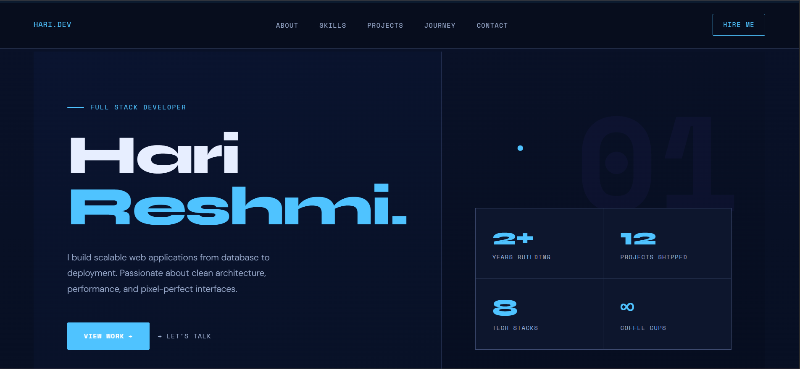

# Hari Portfolio 

A modern personal portfolio website with smooth scrolling, animated sections, project highlights, and a dedicated project details page.

## Live Sections

- Hero introduction
- About
- Skills
- Projects
- Journey
- Contact (WhatsApp form flow)

## Tech Stack

- HTML5
- CSS3 (custom design system in page styles)
- Vanilla JavaScript
- Lenis (smooth scrolling)
- Google Fonts (Space Mono, Syne, DM Sans)

## Project Structure

- `index.html` - Main portfolio page
- `project.html` - Single project details page
- `projects-data.js` - Project metadata and content
- `project.js` - Project page rendering logic
- `assets/` - Project assets and previews

## Run Locally

This is a static project, so you can run it in either way:

1. Open `index.html` directly in your browser.
2. Or run with VS Code Live Server for a better development workflow.

## How To Add Project Screenshots In README

Store screenshots in `assets/screenshots/` and reference them with relative paths.

### Step 1: Capture and Save Screenshot

- Take a screenshot of your project.
- Save it as PNG or JPG inside `assets/screenshots/`.
- Example filename: `home-hero.png`

### Step 2: Add Image In Markdown

Use this format in README:

```md

```

### Step 3: Control Display Size (Optional)

If you want smaller width:

```html

```

## Quick Paste Workflow (Recommended)

1. Open the folder `assets/screenshots/` in VS Code Explorer.
2. Paste your screenshot there (Ctrl + V) or drag-drop image files.
3. Add markdown image line in this README.
4. Commit both the README update and image file.

## Screenshots



## Notes

- Keep image names simple: lowercase with hyphens.
- Prefer PNG for UI screenshots.
- Compress large images so the repository stays lightweight.
